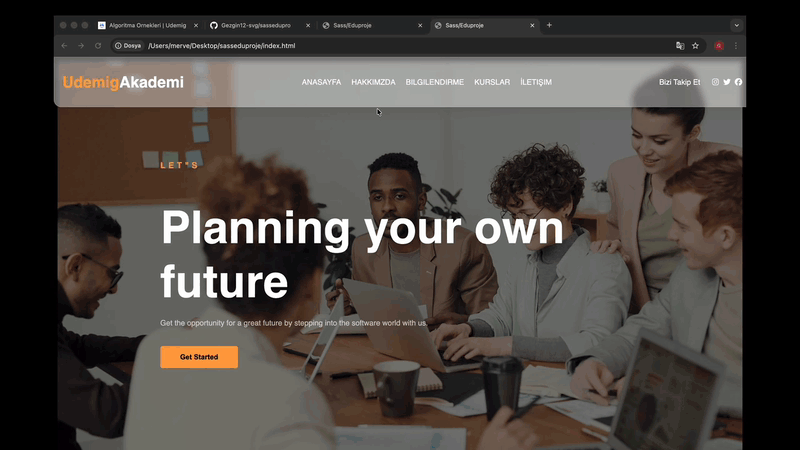

<<<<<<< HEAD

=======

# 🎓 Udemig Akademi

Modern ve responsive bir yazılım akademisi web sitesi tasarımı.
Bu proje HTML5, CSS3 ve SCSS kullanılarak geliştirilmiş statik bir eğitim platformu arayüz çalışmasıdır.

---

## 🚀 Proje Özellikleri

- Responsive tasarım
- Modern Hero Section
- Kart tabanlı kurs yapısı
- Hover efektleri
- İletişim formu tasarımı
- Footer sosyal medya alanı
- SCSS modüler yapı

---

## 🛠️ Kullanılan Teknolojiler

- HTML5
- CSS3
- Sass (SCSS)
- Flexbox
- CSS Grid
- Media Queries

---

## 📸 Ekran Görüntüsü

---

## 🎯 Projenin Amacı

Bu proje;

- Component mantığını geliştirmek
- SCSS ile modüler yapı oluşturmak
- Responsive tasarım pratiği yapmak

amacıyla geliştirilmiştir.

---

## 🌱 Geliştirme Planı

- Form validasyon eklenmesi
- JavaScript ile etkileşim artırılması
- Dark / Light Mode desteği
- Animasyon geliştirmeleri

---

## 👩🏻‍💻 Developer

**Gezgin Yazılımcı**  
Frontend Developer Adayı
